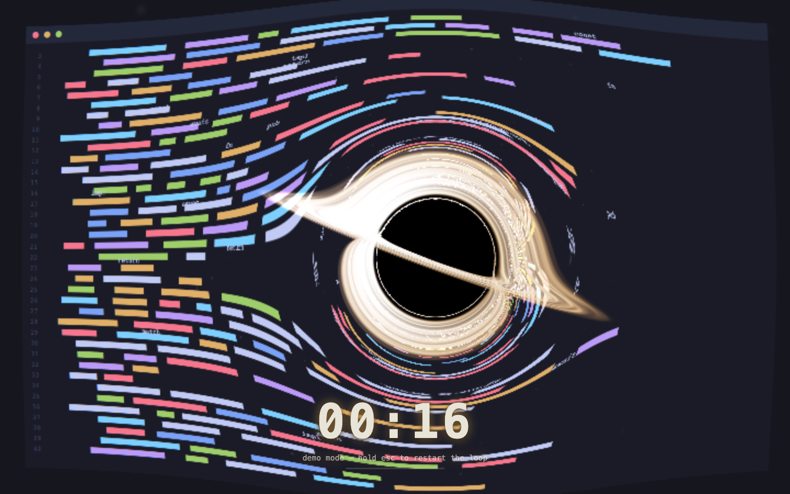

# holedeep

**focus, or be devoured.**

A pomodoro timer for macOS where break time is enforced by a black hole. When
your focus session ends, a Schwarzschild black hole spawns over your live
desktop and gravitationally lenses your work into oblivion — photon ring,
accretion disk, chromatic aberration and all — until the break is over and it
evaporates.

Built with Tauri 2 + React + WebGL2.



## How it works

1. The Rust side runs a real work/break timer (tray icon included).
2. At break start it screenshots every monitor (`xcap`) for an instant first
   frame, opens a borderless always-on-top overlay window per monitor, then
   starts a ScreenCaptureKit stream (`scap`) per display — excluding the
   overlays themselves so the hole doesn't capture itself. The overlay polls
   ~15 fps, so the desktop stays *live* while being devoured.
3. The overlay renders the desktop through a WebGL2 fragment shader that
   integrates null geodesics through the Schwarzschild metric per pixel —
   the shadow, lensing, and photon ring emerge from the physics, they are
   not painted on.
4. Break ends → the hole collapses → overlays close → back to work.

The screen is never actually locked: hold **Esc** for 2.5 s to skip a break.

## Development

```sh
npm install
npm run tauri dev
```

The overlay has a browser demo mode with a synthetic desktop: run
`npm run dev` and open <http://localhost:1420/overlay.html> — useful for
shader work without triggering real breaks.

On first break, macOS will ask for the **Screen Recording** permission
(System Settings → Privacy & Security). Without it the black hole renders
over deep space instead of your desktop.

## Credits

The shader is a WebGL2 port of
[`blackhole.glsl`](https://github.com/s0xDk/ghostty-blackhole) by
**s13k** (MIT), itself after Eric Bruneton's
[Real-time High-Quality Rendering of Non-Rotating Black Holes](https://ebruneton.github.io/black_hole_shader/).
The original terminal shader had no state, so it faked its pomodoro with
wall-clock arithmetic; here the timer is real and the shader just gets told
how hungry to be. The pristine original lives in `shaders/reference/`.
